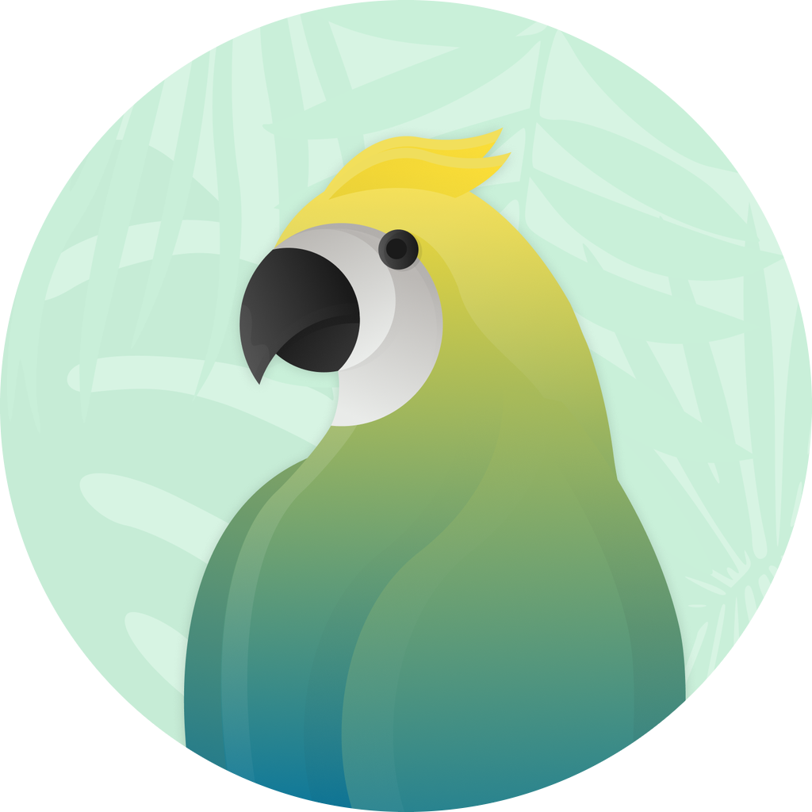

## I'm a Zaïr, a young developper !

- 👟 I work in the sneaker business, building monitors, bypass and bots
- 👨‍💻 I’m owner of **@KoraScript**, **@KoraTools**  and **@JungleHouse** 
- 🥅 2022 Goals: Finish Akamai BP, and start CF BP
- 🎯 I learned everything I know by myself, thanks Youtube and StackOverflow

### Languages and Tools:

 
 

---

  
:zap: GitHub Stats

  

